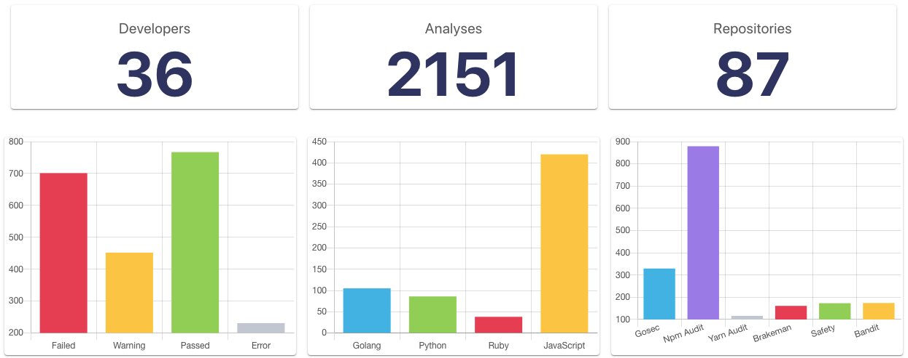

<p align="center"></p>

<p align="center">
  <a href="https://github.com/globocom/huskyCI-dashboard/releases"></a>
  <a href="https://gitter.im/globocom/huskyCI"></a>
  <a href="https://circleci.com/gh/globocom/huskyCI/tree/master"></a>
  <a href="https://github.com/rafaveira3/writing-and-presentations/blob/master/DEFCON-27-APP-SEC-VILLAGE-Rafael-Santos-huskyCI-Finding-security-flaws-in-CI-before-deploying-them.pdf"></a>
  <a href="https://www.blackhat.com/eu-19/arsenal/schedule/#huskyci-performing-security-tests-inside-your-ci-17792"></a>
</p>

## How does it work?

The main goal of this project is to provide a front-end for every huskyCI user to check the stats of the analyses done. If you don't know yet what huskyCI is, check it out [here](https://github.com/globocom/huskyCI).

<p align="center"></p>

## Requirements

### Node
If you don't have Node installed in your environment, follow the instructions [here](https://gist.github.com/d2s/372b5943bce17b964a79) for your correspondent OS.

### Yarn

```sh
npm install -g yarn
```

## Installing
After cloning this repository, simply run these commands inside huskyCI-dashboard's folder:

```sh
yarn install
echo 'export REACT_APP_HUSKYCI_FE_API_ADDRESS="http://127.0.0.1:8888"' > .env
source .env
```

## Running
After installing, an .env file with instructions to huskyCI-dashboard should be generated:

```
yarn start
```

## Contributing

Please read [CONTRIBUTING.md](CONTRIBUTING.md) for details on our code of conduct and the process of submitting pull requests to huskyCI-dashboard.

## License

This project is licensed under the BSD 3-Clause "New" or "Revised" License - read [LICENSE.md](LICENSE.md) file for details.

[Docker Install]:  https://docs.docker.com/install/
